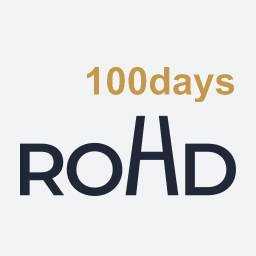

# ROHD 스토리 페이지 언어 이동 전 로딩 화면 가이드

## 목적

`rohd/index.html`은 브라우저 언어 또는 저장된 언어 설정을 확인한 뒤 실제 언어 페이지로 이동하는 중간 페이지입니다.

언어 페이지가 열리기 전 잠시 빈 화면이나 흰 화면이 보이지 않도록, 이동 로직보다 먼저 실제 스토리 페이지와 어울리는 배경과 ROHD 로고를 표시합니다.

이 문서는 같은 방식으로 다른 스토리 페이지의 언어 선택용 중간 페이지를 구성할 때 참고합니다.

## 기본 원칙

1. `body` 배경은 실제 언어 페이지의 첫 화면과 같은 색과 그라데이션으로 지정합니다.
2. 로고는 JavaScript로 생성하지 않고 HTML에 직접 배치합니다.
3. 로고 경로는 중간 페이지의 위치를 기준으로 한 상대 경로를 사용합니다.
4. 로고와 로딩 안내 문구를 먼저 HTML에 둔 뒤, 기존 언어 감지·저장 언어 로직을 실행합니다.
5. 로딩 안내 문구는 화면에는 보이지 않지만 화면 낭독기에는 전달되도록 숨깁니다.
6. 실제 언어 페이지로 이동할 때는 `location.replace()`를 사용해 중간 페이지가 브라우저 뒤로가기에 남지 않게 합니다.
7. 언어 감지 전에 별도의 지연 시간이나 긴 애니메이션을 넣지 않습니다.

## ROHD 중간 페이지 구조

`/rohd/index.html`에서는 다음 구조를 사용합니다.

```html
<main class="loading-screen" aria-label="ROHD loading">
  
  <p class="loading-message">Loading ROHD…</p>
</main>
```

CSS는 페이지의 왼쪽 상단에 로고를 표시하고, 로딩 문구는 접근성 정보로만 남깁니다.

```css
html,
body {
  margin: 0;
  min-height: 100%;
  background:
    linear-gradient(135deg, rgba(36, 76, 134, .12), transparent 34%),
    linear-gradient(225deg, rgba(180, 139, 55, .10), transparent 28%),
    #f6f8fb;
}

.loading-screen {
  min-height: 100vh;
  padding: 32px 24px;
  box-sizing: border-box;
}

.loading-logo {
  display: block;
  width: 64px;
  height: 64px;
}

.loading-message {
  position: absolute;
  width: 1px;
  height: 1px;
  padding: 0;
  margin: -1px;
  overflow: hidden;
  clip: rect(0, 0, 0, 0);
  white-space: nowrap;
  border: 0;
}
```

## 경로와 로고 선택

중간 페이지의 위치에 따라 로고의 상대 경로를 변경합니다.

| 중간 페이지 위치 | 로고 경로 예시 |
|---|---|
| `/index.html` | `./images/Logo_ROHD.png` |
| `/rab/index.html` | `../images/Logo_ROHD.png` |
| `/rohd/index.html` | `../images/Logo_ROHD.png` |
| `/dream/index.html` | `../images/Logo_ROHD.png` |

ROHD 스토리 페이지는 ROHD 앱 아이콘을 사용합니다. 다른 스토리의 브랜드 로고가 별도로 있다면 해당 페이지의 로고 파일로 바꿉니다.

## 언어 이동 로직

로딩 화면 아래에는 기존 언어 감지 및 이동 로직을 그대로 둡니다.

```js
const language = supported.includes(requested) ? requested :
  supported.includes(savedLanguage) ? savedLanguage : browserLanguage;

location.replace("./index_" + language + ".html");
```

다른 스토리 페이지에 적용할 때는 언어별 파일명과 목적지만 해당 페이지에 맞게 변경합니다. `lang` 쿼리 우선 처리, `fci-language` 저장값, 브라우저 언어 감지 순서는 유지합니다.

## JavaScript가 꺼진 경우

`noscript` 안에는 언어별 페이지로 직접 이동할 수 있는 링크를 남깁니다.

```html
<noscript>
  <p>
    <a href="./index_ko.html" lang="ko">한국어</a> ·
    <a href="./index_en.html" lang="en">English</a>
  </p>
</noscript>
```

실제 페이지의 지원 언어가 늘어나면 이 링크도 함께 추가합니다.

## 확인 항목

- 새로고침 직후 흰 화면 대신 ROHD 스토리와 같은 밝은 배경과 그라데이션, ROHD 로고가 보이는가?
- 로고가 화면 왼쪽 상단에 표시되고 잘리지 않는가?
- 한국어·영어 및 지원 언어가 기존 감지 규칙대로 열리는가?
- `fci-language` 저장값이 브라우저 언어보다 우선하는가?
- `?lang=ko`와 같은 명시적 언어 선택이 정상 작동하는가?
- JavaScript가 꺼져도 `noscript` 언어 링크가 보이는가?
- 중간 페이지가 브라우저 뒤로가기에 불필요하게 남지 않는가?
- `git diff --check`에서 공백 오류가 없는가?
